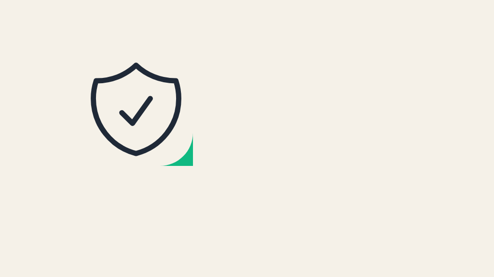

# blog-cover-generator

Generate consistent blog post cover images from a [Heroicons](https://heroicons.com) icon — no AI image generation service, no API costs, no rate limits. Renders an HTML page with [Playwright](https://playwright.dev) and screenshots it to a PNG.


## Why

AI image generators are great until you run out of credits, need dozens of consistent images for a blog archive, or just want something you can regenerate for free, forever. This produces a clean, on-brand cover image (an icon on a solid background with a small accent badge) in under a second, fully offline after install.

## Usage

```bash
# One-time: download the Chromium build used for rendering (~150MB)
npx blog-cover-generator install-browser

npx blog-cover-generator <slug> <heroicon-name> [out-dir]
```

Example:

```bash
npx blog-cover-generator my-first-post server ./covers
# -> ./covers/my-first-post.png
```

Or install it globally / as a dev dependency: `npm install -g blog-cover-generator` (or `npm install -D blog-cover-generator`).

Run `blog-cover-generator --list-icons` to print every valid icon name (also browsable at [heroicons.com](https://heroicons.com)), `--help` for all options and `--version` for the version.

### Customizing colors and size

```bash
npx blog-cover-generator my-post rocket-launch \
  --width 1600 --height 900 \
  --bg "#111111" --fg "#FFFFFF" --accent "#FF5C00"
```

| Flag | Default | Description |
|---|---|---|
| `--width` | `2048` | Image width in pixels |
| `--height` | `1152` | Image height in pixels |
| `--bg` | `#0A0D16` | Background color |
| `--fg` | `#F2F3F5` | Icon color |
| `--accent` | `#1E9BFF` | Corner accent badge color |
| `--list-icons` | | Print available icon names and exit |
| `-h`, `--help` / `-v`, `--version` | | Help / version |

## Gallery

Every image below was generated with the exact command shown (at 1024x576 to keep the files small; the default is 2048x1152). The icon sits on the left third of the canvas on purpose, leaving the right side free for a title or overlay in your blog theme.

| Output | Command |
|---|---|
|  | `blog-cover-generator default-look server ./examples --width 1024 --height 576` |
|  | `blog-cover-generator orange-rocket rocket-launch ./examples --width 1024 --height 576 --bg "#111111" --fg "#FFFFFF" --accent "#FF5C00"` |
|  | `blog-cover-generator light-shield shield-check ./examples --width 1024 --height 576 --bg "#F5F1E8" --fg "#1F2937" --accent "#10B981"` |
|  | `blog-cover-generator violet-chart chart-bar ./examples --width 1024 --height 576 --bg "#1E1B4B" --fg "#E0E7FF" --accent "#F472B6"` |

### Batch: covers for many posts

Put one `<slug> <icon>` pair per line in a file, then loop over it:

```bash
cat > posts.txt <<'EOT'
intro-to-docker cube
monitoring-with-grafana chart-bar
hardening-ssh shield-check
EOT

while read -r slug icon; do
  npx blog-cover-generator "$slug" "$icon" ./covers --bg "#0A0D16" --accent "#1E9BFF" || echo "FAILED: $slug" >&2
done < posts.txt
# -> ./covers/intro-to-docker.png, ./covers/monitoring-with-grafana.png, ...
```

Each invocation launches its own browser (about a second each), which is fine for a few hundred posts. Failures (for example a mistyped icon) are reported per line and do not stop the rest of the batch.

## How it works

1. Loads the requested Heroicons outline SVG and extracts its inner markup
2. Adds a small accent badge in the icon's own viewBox, so it stays anchored to the icon's corner regardless of icon shape
3. Renders it centered on a solid-color page at the requested dimensions
4. Launches headless Chromium via `playwright-core`, screenshots the page, saves the PNG

## Troubleshooting

**"Chromium is not installed"** - the browser is not downloaded by `npm install`. Run `blog-cover-generator install-browser` once (`npm run install-browser` in a checkout).

**The Chromium download fails or hangs** - it is fetched from the Playwright CDN (~150MB). Behind a proxy, set `HTTPS_PROXY` before running `install-browser`. To use a shared location (for example in CI or Docker), set `PLAYWRIGHT_BROWSERS_PATH` to the same directory for both the install and the run. On a minimal Linux image, Chromium may also need system libraries; install them with `npx playwright-core install-deps chromium` (requires root).

**`Unknown icon "serverr". Did you mean: server?`** - the icon name must match a Heroicons outline file exactly (lowercase, hyphenated). The tool suggests close matches; `blog-cover-generator --list-icons | grep rocket` searches the full list.

**`Invalid slug` / `Invalid icon name`** - slugs may contain only letters, digits, `-` and `_` (and must start with a letter or digit); icon names only lowercase letters, digits and `-`.

**`--width must be a positive integer` / `--bg must be a hex color`** - use whole numbers for sizes and `#rgb` or `#rrggbb` colors (quote them in the shell: `--bg "#111111"`).

## Requirements

- Node.js 18+
- A Chromium binary (~150MB), downloaded explicitly once with `blog-cover-generator install-browser` (it is not fetched during `npm install`)

## Development

```bash
git clone https://github.com/diogocouto18/blog-cover-generator && cd blog-cover-generator
npm ci
npm run install-browser   # Chromium
npm run generate -- my-post server ./covers   # run from source via tsx
npm run typecheck && npm test
npm run build             # compile to dist/
scripts/smoke-pack.sh     # pack, install the tarball in a clean dir and render a PNG
```

## License

MIT
